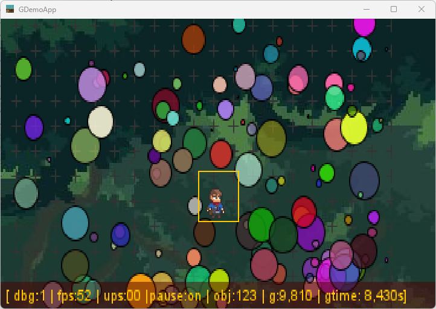

# README

[](http://nextserver02-1/SnapGames/minimal) | [](https://github.com/SnapGames/minimal/actions/workflows/maven.yml)

This is a small Minimalistic Game project , based on a master Game Java class, with some subclasses to let keep the code
ass short as possible.

## Goals

This Mini'mal project propose an exploration of structure and services required by a 2D platformer. 

**GameObject** & **Scene** with **Behavior**, **Particle System** with effects, Ambient and Spot **Light**,  **Resource** and Manager, **Renderer** with plugin, **PhysicEngine**, **World** and **Material**, all the game ingredients are design in their simplest flavour to let understand the complexity of 2D platform game.

## Coming soon

The future coming evolution will be Water simulation with Influencer, addon to the PhsyicEngine, Collision detection and resolution, evolution of already defined Behavior.


## let's try ?

### Compile

Based on standard Maven tooling, a simple command line will provide a JAR:

```shell
$ mvn clean install
```

### Run

To run the produced artifact, multiple solution :

1. Execute from maven command

```shell
$ mvn exec:java
```

2. execute the produced jar from the target directory:

```shell
$ java -jar target/game-0.0.1-SNAPSHOT-shaded.jar
```

## Demo

After starting the latest jar file, the following picture may appear:



_figure 1 - Latest enhanced minimal game framework_

You can interact with the demo with the following keys :

| Key                              | Description                                                   |
|----------------------------------|---------------------------------------------------------------|
| <kbd>ESCAPE</kbd>                | Exit from demo                                                |
| <kbd>D</kbd>                     | Switch debug display mode from level 0 to 4 (O=off)           |
| <kbd>UP</kbd>                    | move character up                                             |
| <kbd>DOWN</kbd>                  | move character down                                           |
| <kbd>LEFT</kbd>                  | move character left                                           |
| <kbd>RIGHT</kbd>                 | move character right                                          |
| <kbd>PAGE_UP</kbd>               | Add more coins                                                |
| <kbd>PAGE_DOWN</kbd>             | remove some coins                                             |
| <kbd>DELETE</kbd>                | remove all coins                                              |
| <kbd>P</kbd> or <kbd>PAUSE</kbd> | Pause the update physic engine phase                          |
| <kbd>R</kbd>                     | Switch rain (demonstrate particles effects)                   |
| <kbd>B</kbd>                     | Switch background image/stars (show background possibilities) |
| <kbd>G</kbd>                     | Switch gravity (show the PhysicEngine World context effect)   |


## Contribute

if you want to contribute to the experiment, just contact me via github 

McG.
