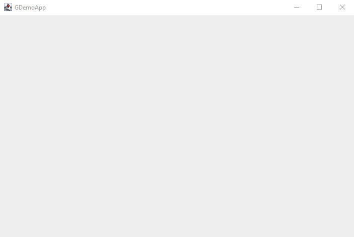
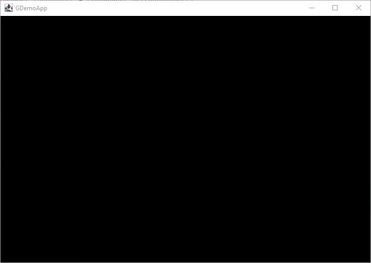

# Start drawing with Renderer

_(TO BE REVIEWED)_

The first alluring thing to do in this series is to implement some graphics rendering. And before drawing
anything, I will certainly need to create a first window to display some fantastic and beautiful pixel arts:)

## A Window

Yes, I know, we could have go with Unity, OpenGL or any fancy (and too complex) framework, for game of just a graphics
library, but The goal of this article series is to stick to the Java JDK.

So I am going to do a sacrifice of JavaFX, yes, I won't use it, because, rendering pixel is really too challenging with
it.
I'll prefer the good old pals whose are AWT and Swing!

Let's keep it simple, and get minimum number of attributes and methods; the most complex part is the createPanel(),
creating and initializing
the  [`JFrame`](https://docs.oracle.com/en/java/javase/19/docs/api/java.desktop/javax/swing/JFrame.html) component
instance, and setting its parameters.

```java
public class Window {

    String title;
    int width;
    int height;
    private JFrame frame;

    public Window(String title, int width, int height) {
        createPanel(title, width, height, false);
    }

    private void createPanel(
            String title,
            int width, int height,
            boolean fullScreenMode) {
        Dimension dim = new Dimension(width, height);
        frame = new JFrame(title);
        frame.setPreferredSize(dim);
        GraphicsDevice gd = GraphicsEnvironment.getLocalGraphicsEnvironment().getDefaultScreenDevice();
        frame.setLocationRelativeTo(null);
        if (fullScreenMode) {
            gd.setFullScreenWindow(frame);
        } else {
            gd.setFullScreenWindow(null);
        }
        frame.setDefaultCloseOperation(JFrame.EXIT_ON_CLOSE);
        frame.setFocusTraversalKeysEnabled(true);
        frame.pack();
        frame.setVisible(true);
        frame.requestFocus();
    }

    public void close() {
        frame.setVisible(false);
        frame.dispose();
    }
}
```

The attributes _title_, _width_ and _height_ will describe our Window:

- `title` is the window title bar
- `width` and `height`… the size of the window.

I'd like to propose a full-screen mode, to splash our window all over the screen, so we need to implement something:

```java
public class Window {
    //...
    private boolean fullScreenMode;

    //...
    public Window(String title, int width, int height, boolean bFullScreenMode) {
        this.title = title;
        this.height = height;
        this.width = width;
        this.fullScreenMode = bFullScreenMode;
        createPanel(title, width, height, fullScreenMode);
    }
    //...

    public void switchFullScreen(boolean bFullScreen) {
        this.fullScreenMode = bFullScreen;
        if (bFullScreen && frame.isVisible()) {
            frame.setVisible(false);
            frame.dispose();
        }
        createPanel(this.title, this.width, this.height, bFullScreen);
    }
    //...

    private void createPanel(
            //...
            frame.addComponentListener(new ComponentAdapter() {
        public void componentResized (ComponentEvent componentEvent){
            setHeight(frame.getHeight());
            setWidth(frame.getWidth());
        }
    });
    //...
}
//...
}
```

You can notice the new switchFullScreen() method; its name is speaking itself. The full screen state is hosted by the
fullScreenMode class attribute.

The new added ComponentAdapter in the createPanel() is more tricky, it helps our Window support resizing operation and
adapt content size and its redraw.

To use it, simple: to create a new Window:

```java
Window myWindow=new Window("MyWindow",320,200);
```

To switch this Window in full screen mode:

```java
myWindow.switchFullScreen(true);
```

In the Application class we will add the Window instantiation :

```java
public class App implements Game {
    //...
    public int initialize(String[] args) {
        System.out.printf("Start %s%n- initializing...%n", getAppName());
        //...
        // initialize your system and services from here
        window = new Window(
                (String) config.get(ConfigAttribute.APP_TITLE),
                (int) config.get(ConfigAttribute.WINDOW_WIDTH),
                (int) config.get(ConfigAttribute.WINDOW_HEIGHT));
        //...
        logger.log(Level.INFO, "- initialization done.");
        return initStatus;
    }
    //...
}
```

And running the application now:

```bash
gradle run
```

you may get the following window :



It is now time I spent some time coding the Renderer; the system role consists in drawing all the game objects into
the newly created Window.

## The Renderer

Let's have a Renderer class with some attributes:

- a parent **game** instance
- a **screen width** and **height** to define the rendering area size,
- a **window width** and **height** to set a Window,
- an internal **buffer** where to draw game's things.

```java
public class Renderer {

    private final Game game;
    private BufferedImage buffer;
    int windowWidth;
    int windowHeight;
    int screenWidth;
    int screenHeight;
}
```

Now we need to initialize things. I will rely on the Configuration system and its config.properties file to get default
values.

```java
public class Renderer {
    //...
    public Renderer(Game g) {
        this.game = g;
        Confniguration conf = game.getConfiguration();
        windowWidth = (int) conf.get(ConfigAttribute.WINDOW_WIDTH);
        windowHeight = (int) conf.get(ConfigAttribute.WINDOW_HEIGHT);
        screenWidth = (int) conf.get(ConfigAttribute.SCREEN_WIDTH);
        screenHeight = (int) conf.get(ConfigAttribute.SCREEN_HEIGHT);
        buffer = new BufferedImage(
                screenWidth,
                screenHeight,
                BufferedImage.TYPE_INT_ARGB);
    }
    //...
}
```

Just getting values from the config.properties:

```properties
# Application
app.main.title=Game01
# Window configuration attributes
app.window.width=720
app.window.height=480
app.window.fullscreen=false;
# Screen configuration attributes
app.screen.width=320
app.screen.height=200
```

Here we define some interesting values for our rendering screen

- `app.main.title` to set a title to the Window,
- `app.screen.width` and `app.screen.height` defining the size of the internal rendering buffer, where pixel will live
  forever ;)

but also for our window!

- `app.window.width`, `app.window.height` and `app.window.fullscreen` will define the size of the display window, and if
  we want it created in fullscreen mode or not.

Now we have a `Window` and a `Renderer` instance, we can `draw(int)`:

```java
public class Renderer {
    //...
    public Renderer(Game g) {
        this.game = g;
        Confniguration conf = game.getConfiguration();
        windowWidth = (int) conf.get(ConfigAttribute.WINDOW_WIDTH);
        windowHeight = (int) conf.get(ConfigAttribute.WINDOW_HEIGHT);
        screenWidth = (int) conf.get(ConfigAttribute.SCREEN_WIDTH);
        screenHeight = (int) conf.get(ConfigAttribute.SCREEN_HEIGHT);
        buffer = new BufferedImage(
                screenWidth,
                screenHeight,
                BufferedImage.TYPE_INT_ARGB);
    }
    //...
}
```

we gather
the [Graphics2D](https://download.java.net/java/early_access/loom/docs/api/java.desktop/java/awt/Graphics2D.html) API
instance to draw on the buffer.

1. we clear the drawing area with the black color,
2. here, as an example, we draw a beautiful red rectangle,
3. and finally, we free API resources.

> **Note:** You may have noticed the 'fps' attribute in the `draw(int)` method, it will be used later to display some
> debug information.
> And after having drawn everything we need into the buffer, copy that buffer onto the `Window`:

```java
public class Renderer {
    //...
    public void drawToWindow(Window w) {
        // [1]
        Graphics2D g = w.getGraphics2D();
        // [2]  
        g.setBackground(Color.BLACK);
        // [3]
        g.drawImage(buffer,
                0, 0, w.width, w.height,
                0, 0, screenWidth, screenHeight,
                null);
    }
    //...
}

```

1. gather the drawing API instance from the `Window` component,
2. set the background color to black,
3. copy `Renderer` buffer image to the `Window`, taking care of the resizing.

## In the Game

From the parent `Game`, we will first initialize systems and window:

```java
public class Game {
    // [1]
    Configuration config = new Configuration(ConfigAttribute.values());
    private Window window;
    private Renderer renderer;

    // [2]
    public Game(String[] args) {
        config.setConfigurationFile("/config.properties");
    }

    //...
    public void initialize() {
        // [3]
        window = new Window(
                (String) config.get(ConfigAttribute.APP_TITLE),
                (int) config.get(ConfigAttribute.WINDOW_WIDTH),
                (int) config.get(ConfigAttribute.WINDOW_HEIGHT));
        // [4]
        renderer = new Renderer(this);
    }
    //...
}
```

1. set `Configuration` required enum attributes,
2. read `Configuration` properties file,
3. the already added `Window` initialization with correct values from configuration,
4. initialize the `Renderer` system.

And then call that render (from the game loop) method to draw the rendered buffer onto the game `Window` instance:

```java
public class Game {
    //...
    public void render(Game g, int fps) {
        // [1]
        renderer.draw(fps);
        // [2]
        renderer.drawToWindow(window);
    }
    //...
}
```

1. draw game things on the `Renderer` buffer,
2. copy that buffer to the `Window`.

And here we are, we are able to draw things on our `Window`!



Yes, I know a black screen is not exactly what you were expected, but we are an ion the road of creating things :)

## Conclusion

So 2 new things, a `Window` (yes, we now have one), and a way to draw something on it with `Renderer` !

Like in the 1st and the 2nd episodes, you will find one more time the presented code on the GitHub repository you
already know now: https://github.com/SnapGames/game101 on
tags [create-window](https://github.com/SnapGames/game101/releases/tag/create-window)
and [create-renderer](https://github.com/SnapGames/game101/releases/tag/create-renderer).

That’s all folks!

McG.