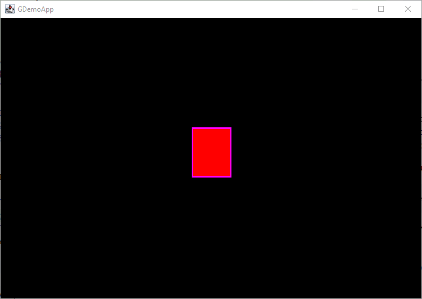

# Bring Entity and its manager

_(TO BE REVIEWED)_

Now I have some tools to display things; it's time to get some object to display!

I am going to present a new class; the `Entity` class. And as this chapter's title learns to us, I am goinf to create
another internal System to manage and take care of those objects; the `EntityManager`.


_figure 1 - The Entity and its Manager diagram class_

## Entity

This `Entity` will be the base for any object that can be displayed (or not) and managed by the `Game`.

> **Note:** An internal helper usage will consist in providing a fluent API to the Entity setters.

As I could have many of those entities on my screen, I need to get some clear way to identify it. I'll use a generated
internal `id` for unity, and a `name` for developer usage, to get it more humankind, but this name will be default
generated.

```java
public class Entity {
    private static long index = 0;
    private long id = index++;
    private String name = "entity_" + id;
}
```

In the Entity definition, we create the mechanism to initialize the id and name to some default values:

- `id` is initialize with an internal index counter incremented on each Entity instantiation,
- `name` is initialized to "entity_[id]" where id will be the current incremented index value.

But we want to display our entity, so we need more attributes :

- `x`,`y` the position on the play area of a that object,
- `width` and `height`, the current size of that object (in a Rectangle box first, this will change on the future),
- `dx`,`dy` some speed information

```java
public class Entity {
    //...
    public double x;
    public double y;
    public double dx;
    public double dy;
    public double width;
    public double height;
}
```

We also need to draw it, so add some graphics information:

- `borderColor` a border draw color,
- `fillColor` a color to fill our entity with.

```java
public class Entity {
    //...
    public Color frontColor = Color.WHITE;
    public Color fillColor = Color.BLUE;
}
```

## EntityManager

_One system to rule them all._

This System will be very basic, based on the Map pattern to maintain the internal entity list.

```java
public class EntityManager {
    // [1]
    Map<String, Entity> entities = new ConcurrentHashMap<>();

    // [21]
    public EntityManager() {
    }

    // [3]
    public Entity get(String name) {
        return entities.get(name);
    }

    // [4]
    public void add(Entity e) {
        entities.put(e.getName(), e);
    }

    // [5]
    public Map<String, Entity> getEntityMap() {
        return entities;
    }

    // [6]
    public Collection<Entity> getEntities() {
        return entities.values();
    }
}
```

1. create a Map of Entity to easily retrieve an Entity on its name,
2. get an entity on its name (from the map),
3. Add an entity to the map,
4. retrieve the full map of entity
5. get the collection of the existing Entities from the map.

## In the Game

So, back to the Game class, we need to add this new system to support entity, and we also need to draw those entities.

```java
public class Game {
    //...
    EntityManager entityMgr;

    //...
    public void initialize() {
        //...
        entityManager = new EntityManager();
    }
//...
}
```

Let's add some Entity:

```java
public class Game {
    public void create() {
        Entity player = new Entity("player")
                .setSize(16, 16)
                .setPosition(100, 100)
                .setSpeed(0, 0);
    }

    //...
    public EntityManager getEntityManager() {
        return entityMgr;
    }
}
```

And if we want to let the Renderer draw that entity, we need to modify it a bit.

## Renderer draw Entity

Go to our already created Renderer class and update it to draw some Entity:

```java
public class Renderer {
    //...
    public void draw(int fps) {
        Graphics2D g = (Graphics2D) buffer.getGraphics();
        // clear buffer with default color;
        g.setColor(Color.BLACK);
        g.fillRect(0, 0, screenWidth, screenHeight);

        // [1]
        game.getEntityManager().getEntities().forEach(e -> {
            drawEntity(g, e);
        });

        g.dispose();
    }

    public drawEntity(Graphics2D g, Entity e) {
        // [2]
        if (Optional.ofNullable(e.fillColor).isPresent()) {
            g.setColor(e.fillColor);
            g.fillRect((int) e.x, (int) e.y, (int) e.width, (int) e.height);
        }
        // [3]
        g.setColor(e.borderColor);
        g.drawRect((int) e.x, (int) e.y, (int) e.width, (int) e.height);
    }
//...
}
```

1. parse the collection of Entity provided by the EntityManager,
2. draw if fillColor is not null a filled rectangle,
3. draw a borderColor rectangle.

If you run this program

```bash
gradle run
```

You will get the following window displayed:



## Conclusion

We finally get some entities, create some of them and draw these to the screen.

Like in the 3 first episodes, you can get code from the GitHub repository you already know
now: https://github.com/SnapGames/game101 on
tag [create-entity](https://github.com/SnapGames/game101/releases/tag/create-entity).

That’s all falk!

McG.