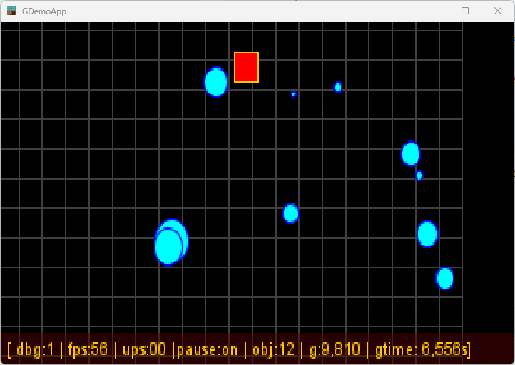
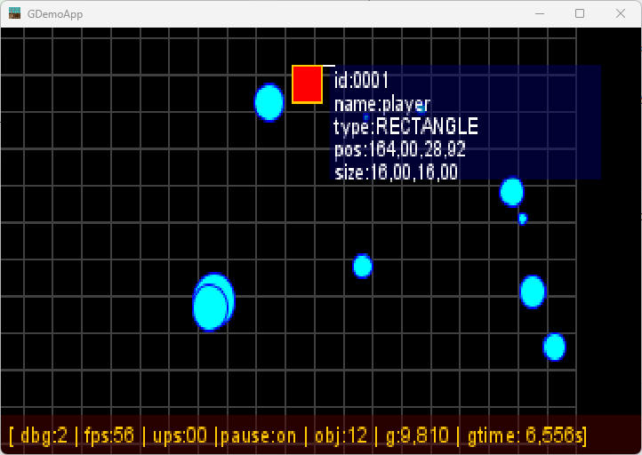
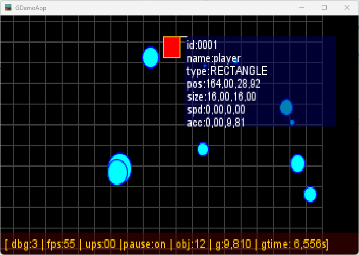
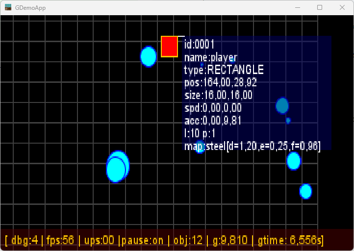

# Display Debugging information

_(TO BE REVIEWED)_

## Goals

The goal of the Display Debug Information layer consists in offering a new way to the developer to _see_ information
about some entities. By configuration, the developer will be able to set a level of details, and define on wich entities
he wants to get the info.


## Rendering debug !

This is possible through the Renderer system, and with some prepared data in the `Entity` itself.

### Adding entity signature

the `getDebugInfo()` method must provide a list of String containing Entity's attributes value.

```java
public class Entity<T> {
    //...
    public List<String> getDebugInfo() {
        List<String> infos = new ArrayList<>();
        infos.add(String.format("name:%s", name));
        infos.add(String.format("pos:%4.2f,%4.2f", x, y));
        infos.add(String.format("size:%4.0fx%4.0f", width, height));
        infos.add(String.format("spd:%4.2f,%4.2f", dx, dy));
        infos.add(String.format("acc:%4.2f,%4.2f", ax, ay));
        infos.add(String.format("map:%s[d=%4.2f,e=%4.2f,f=%4.2f]",
                material.name,
                material.density,
                material.elasticity,
                material.friction));

        return infos;
    }
}
```

### Renderer draw !

The Renderer will have the responsibility to draw those data OVER all other layer, and according to level of details for
the filtered entities.

The level of detail is defined by the `ConfigAttribute.DEBUG_MODE` key value, an integer value from 0 to 5.

- 0 means no debug info display,
- 5 maximum debug display details.

The filtering of data is insured by the 2 `Configuration` keys:

- `ConfigAttribute.DEBUG_WHILE_LIST` the white list contains the coma separated list of entity's names you want's to see
  debug display info for,
- `ConfigAttribute.DEBUG_BLACK_LIST` the black list contains the list you DON'T to see any debug info for.

Those values are set into the `config.properties` file like below:

```properties
#...
# Debug mode and display information
app.debug.mode=1
app.debug.filter.white.list=player,ball_
app.debug.filter.black.list=
#...
```

So in the Renderer#draw() method, we need to loop on the entities, when debug mode value is greater than 0.

```java
public class Renderer {
    public void draw(Map<String, Object> attributes) {
        Graphics2D g = (Graphics2D) buffer.getGraphics();
        //...
        // draw entity's display debug information
        if (game.getDebugMode() > 0) {
            game.getEntityManager().getEntities()
                    .stream()
                    .sorted((o1, o2) -> o1.getLayer() > o2.getLayer() ? 1 : (o1.getPriority() > o1.getPriority() ? 1 : -1))
                    .forEach(e -> {
                        drawDebugInformation(g, e);
                    });
            // draw some debug information.
            drawDisplayDebugLine(g, attributes);
        }

        // release Graphics API
        g.dispose();
    }
}
```

And in the `drawDebugInformation()` method:

> ___TODO___  _explaining and refactor this method that is way more too complex_

```java
public class Renderer {
    private void drawDebugInformation(Graphics2D g, Entity<?> e) {

        if (game.getDebugMode() >= e.debug
                && filterWhiteList.contains(e.name)
                && !filterBlackList.contains(e.name)) {
            g.setColor(Color.ORANGE);
            g.draw(e.box);
            //
            if (game.getDebugMode() > 1) {
                int offX = (int) e.x + 4;
                int offY = (int) e.y;
                g.setFont(g.getFont().deriveFont(8.5f));
                long nbLines = e.getDebugInfo().stream().filter(s -> game.getDebugMode() >= Integer.parseInt(s.substring(1, 2))).count();
                int hh = (int) (g.getFontMetrics().getHeight()
                        * (nbLines - 1));
                if (e.y + hh > buffer.getHeight()) {
                    offY = buffer.getHeight() - hh;
                }

                int ww = g.getFontMetrics().stringWidth(e.getDebugInfo().stream().max(Comparator.comparingInt(String::length)).get());

                if (e.x + ww > buffer.getWidth()) {
                    offX = buffer.getWidth() - ww;
                }

                int l = 0;
                for (String s : e.getDebugInfo()) {
                    if (s.startsWith("(")) {
                        if (game.getDebugMode() >= Integer.parseInt(s.substring(1, 2))) {
                            l += 10;
                            g.setColor(new Color(0.0f, 0.0f, 0.4f, 0.5f));
                            g.fillRect((int) (offX + e.width + 1), offY - 10 + l, ww + 2, 10);
                            g.setColor(Color.WHITE);
                            g.drawString(s.substring(3), (int) (offX + e.width + 4), offY + l);
                        }
                    } else {
                        l += 10;
                        g.drawString(s, (int) (offX + e.width + 4), offY + l);
                    }
                }
                g.drawLine((int) (e.x + e.width + 1.0), (int) e.y, (int) (offX + e.width + 3.0), offY);
            }
        }
    }
}
```

This is now displaying the following information with debug mode level 2 to 5:









## Conclusion

According to our last development and changes, we are now able to display some valuable display debug information.

The corresponding code will be found on GitHub
project [Game101](https://github.com/SnapGames/game101/ "go and visit the GitHut project Gam101").

THs specific add wil lbe linked by tha
tag [create-debug-info](https://github.com/SnapGames/game101/release/tag/create-debug-info).

That's all Folk !

McG.